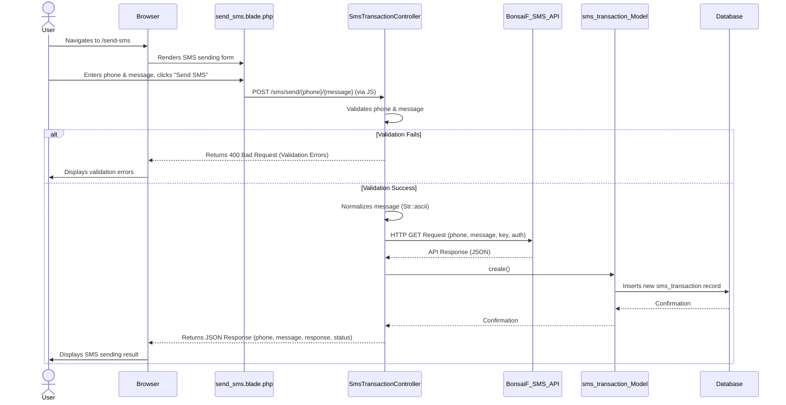
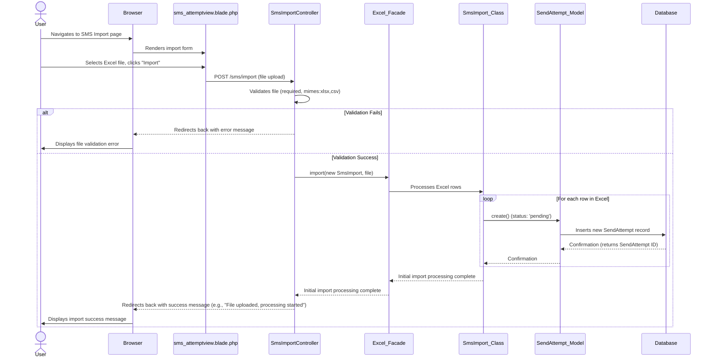
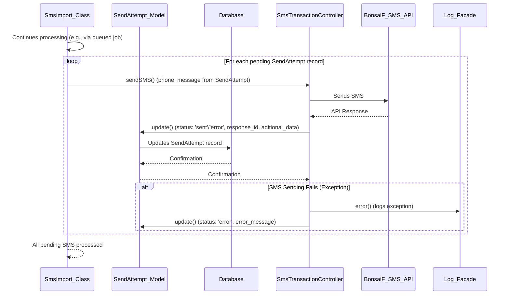

# BonsaiF SMS Application

## Project Overview
A web application for managing and sending SMS messages, including features for bulk SMS import and user management. Built with Laravel, it provides a robust backend for handling SMS transactions and user data, complemented by a user-friendly interface.

## Table of Contents
- [Requirements](#requirements)
- [Key Technologies & Dependencies](#key-technologies--dependencies)
- [Installation Guide](#installation-guide)
- [Key Features](#key-features)
- [Application Documentation](#application-documentation)
    - [Models](#models)
    - [Controllers](#controllers)
- [Data Flow Diagrams](#data-flow-diagrams)

## Requirements
- Laravel v11.3.3
- Composer version 2.8.2
- PHP version 8.2.12 (or compatible, e.g., Laravel Herd)
- Node.js v20.11.0 (or compatible)
- npm 10.2.4 (or compatible)

## Key Technologies & Dependencies
- **Laravel Telescope**: Debugging and insights into application operations.
- **Laravel Breeze/Livewire**: Authentication scaffolding and dynamic UI components.
- **Laravel Auditing**: Comprehensive auditing for Eloquent models.
- **Laravel Excel**: Handles importing and exporting data from spreadsheets.
    - Features used: Import, WithHeadingRow, WithChunkReading, WithBatchInserts, ShouldQueue.
- **Laravel Sanctum**: API authentication.
- **Spatie/Laravel-Permission**: Role and permission management.
- **Tailwind CSS**: Utility-first CSS framework for styling.
  
## Installation Guide

Follow these steps to set up the project locally:

1.  **Clone the repository:**
    ```bash
    git clone <repository_url>
    cd bonsaifsms
    ```

2.  **Install PHP Dependencies (Composer):**
    ```bash
    composer install
    ```

3.  **Install JavaScript Dependencies (NPM):**
    ```bash
    npm install
    npm run dev
    ```

4.  **Environment Configuration:**
    -   Copy the example environment file:
        ```bash
        cp .env.example .env
        ```
    -   Generate an application key:
        ```bash
        php artisan key:generate
        ```
    -   Configure your database connection in the `.env` file. For SQLite, ensure `database/database.sqlite` exists.

5.  **Run Database Migrations and Seeders:**
    ```bash
    php artisan migrate --seed
    ```
    *Note: The `RolesAndPermissionsSeeder` will set up initial roles and permissions.*

6.  **Start the Development Server:**
    ```bash
    php artisan serve
    ```
    The application will typically be available at `http://127.0.0.1:8000`.

## Key Features
-   **User Authentication & Authorization**: Secure login, registration, and role-based access control.
-   **SMS Sending**: Send individual SMS messages via an external API.
-   **Bulk SMS Import**: Import SMS data from Excel files for mass sending.
-   **User Management**: Import user data from Excel/CSV files.
-   **SMS Transaction Logging**: Records of all sent SMS messages.
-   **Auditing**: Tracks changes to key models.

## Usage Details

### File Import (SMS and User)

#### Expected File Formats and Headers

To ensure successful imports, your Excel/CSV files must adhere to specific column headers and data types:

*   **SMS Import (`App\Imports\SmsImport`)**:
    *   `phone` (required): The recipient's phone number.
    *   `message` (required): The SMS message content.
    *   `subject` (optional): Subject of the SMS.
    *   `sponsor` (optional): Sponsor of the SMS.
    *   `identification_id` (optional): Unique identification for the SMS.
    *   `aditional_data` (optional): Any additional data related to the SMS.

    Example SMS Import CSV:
    ```csv
    phone,message,subject,sponsor,identification_id,aditional_data
    +1234567890,Hello World,Promotion,BonsaiF,SMS001,Extra info
    +1987654321,Meeting Reminder,Reminder,Acme Corp,SMS002,Urgent
    ```

*   **User Import (`App\Imports\UsersImport`)**:
    *   `name` (required): User's full name.
    *   `email` (required): User's email address (must be unique).
    *   `password` (required): User's password (will be hashed upon import).

    Example User Import CSV:
    ```csv
    name,email,password
    John Doe,john.doe@example.com,password123
    Jane Smith,jane.smith@example.com,securepass
    ```

#### Import Processing and Status

Large import files are processed in the background using Laravel queues. To ensure these imports are processed, you must have a queue worker running:

```bash
php artisan queue:work
```

You can monitor the status of individual SMS sends after an import on the `sms_attemptview.blade.php` page, which displays details for each `SendAttempt` record.

#### Error Handling During Import

During the import process, any rows that fail validation or encounter errors will be skipped. Detailed error information can be found in the application logs:

```bash
tail -f storage/logs/laravel.log
```

### SMS Sending

#### BonsaiF SMS API Configuration

The application relies on an external BonsaiF SMS API for sending messages. You must configure the API credentials in your `.env` file:

```dotenv
BONSAIF_SMS_API_KEY=your_api_key_here
BONSAIF_SMS_API_AUTH=your_api_auth_token_here
```

#### SMS Response and Statuses

The `response` field in the `sms_transaction` model stores the raw response from the BonsaiF SMS API. This field will contain details such as success codes or specific error messages returned by the API, allowing for detailed tracking of each SMS transaction's outcome.

### Role and Permission Management

The application uses `Spatie/Laravel-Permission` for robust role-based access control.

#### Default Roles and Permissions

Upon running `php artisan migrate --seed`, the `RolesAndPermissionsSeeder` will create the following default roles and permissions:

*   **Roles**:
    *   `admin`: Full administrative access.
    *   `user`: Standard user access.

*   **Permissions**:
    *   `import sms`: Allows importing SMS data.
    *   `send sms`: Allows sending individual SMS messages.
    *   `manage users`: Allows managing user accounts.
    *   *(Additional permissions may be defined in the seeder)*

#### Assigning Roles and Permissions

Roles and permissions can be assigned to users programmatically (e.g., in seeders or through an administrative interface if implemented). For initial setup or testing, you can use Laravel Tinker:

```bash
php artisan tinker
>>> $user = App\Models\User::find(1);
>>> $user->assignRole('admin');
>>> $user->givePermissionTo('import sms');
```

#### Authorization Checks

Authorization checks are performed throughout the application using `Spatie/Laravel-Permission`'s provided methods. For example, in Blade templates, you might see:

```blade
@can('import sms')
    <a href="/sms/import">Import SMS</a>
@endcan
```

And in controllers or policies:

```php
if (Auth::user()->can('send sms')) {
    // User can send SMS
}
```

## Application Documentation

### 1. Models

### `User` Model
- **Purpose**: Manages user authentication and authorization. Integrates with `Spatie\Permission` for roles and permissions.
- **Table**: `users`
- **Fillable Fields**: `name`, `email`, `password`
- **Hidden Fields**: `password`, `remember_token`
- **Casts**: `email_verified_at` (datetime), `password` (hashed)
- **Auditing**: Implements `OwenIt\Auditing\Contracts\Auditable` for tracking changes.

### `sms_transaction` Model
- **Purpose**: Stores records of individual SMS transactions sent through the application.
- **Table**: `sms_transactions`
- **Fillable Fields**: `phone`, `message`, `response`
- **Auditing**: Implements `OwenIt\Auditing\Contracts\Auditable` for tracking changes.

### `SendAttempt` Model
- **Purpose**: Records details of each SMS send attempt, particularly for bulk imports.
- **Table**: `send_attempts`
- **Fillable Fields**: `subject`, `sponsor`, `identification_id`, `phone`, `message`, `status`, `response_id`, `aditional_data`, `created_at`

## Controllers

### `SmsTransactionController`
- **Purpose**: Handles the sending of individual SMS messages via an external API and logs the transactions.
- **Key Methods**:
    - `sendSMS($phone, $message)`: Validates input, normalizes the message, sends the SMS via the BonsaiF API, logs the transaction, and returns the API response.
    - `normalizeMessage($message)`: Converts the message to ASCII.
    - `showForm()`: Displays the `send_sms` view for manual SMS sending.

### `SmsImportController`
- **Purpose**: Manages the import of SMS data from Excel files, processing them for bulk sending.
- **Key Methods**:
    - (Intended for import logic, likely using `Maatwebsite\Excel` and `App\Imports\SmsImport`).


## Data Flow Diagrams

### SMS Sending Flow (`SmsTransactionController`)



### SMS Import Flow - File Upload & Initial Processing



### SMS Import Flow - Individual SMS Sending & Status Update




