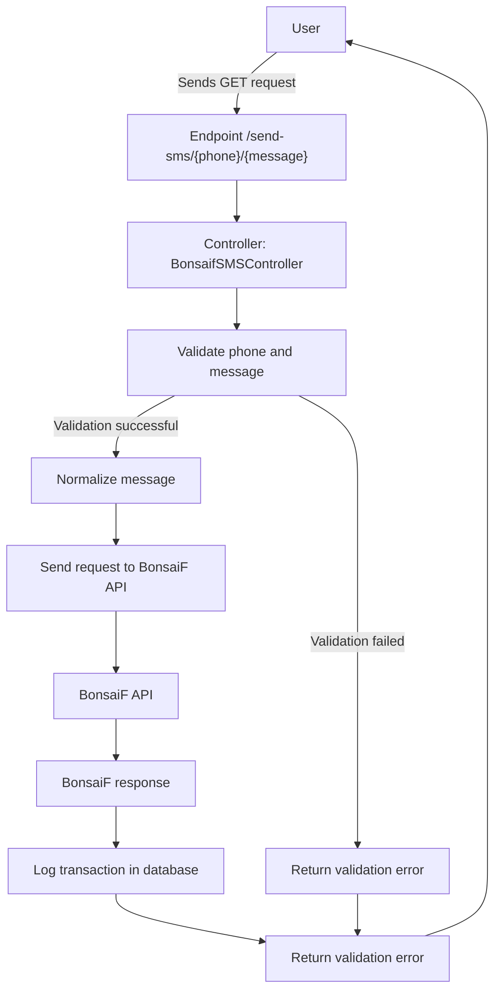
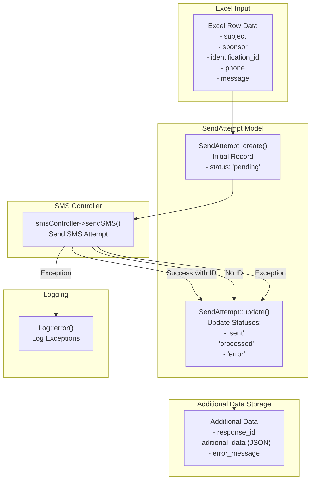

Requeriments

- Laravel v11.3.3
- Composer version 2.8.2 2024-10-29 16:12:11
- PHP version 8.2.12 (Laravel herd)
- node v20.11.0
- npm 10.2.4

***
Complements
- Laravel telescope: https://laravel.com/docs/11.x/telescope
- laravel breeze/livewire: https://laravel.com/docs/11.x/starter-kits
- Laravel auditing: https://laravel-auditing.com/
- Laravel Api routes: https://laravel.com/docs/11.x/routing
- laravel excel
    - Import
    - WithHeadingRow
    - WithChunkReading
    - WithBatchInserts
    - ShouldQueue

***
Sms Transaction Controller - Data Flow

***
Class SmsImport - Data Flow

