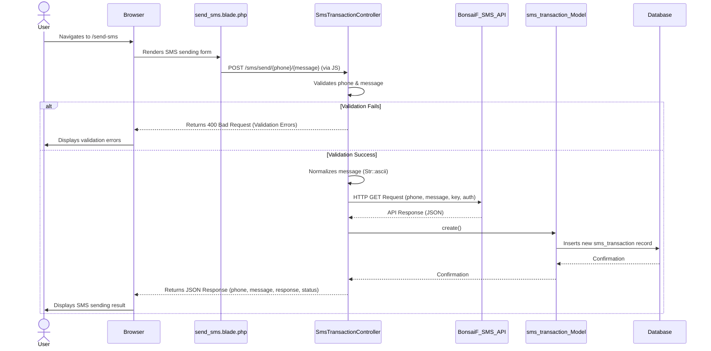

### SMS Sending Flow (`SmsTransactionController`)

```mermaid
sequenceDiagram
    actor User
    participant Browser
    participant send_sms.blade.php
    participant SmsTransactionController
    participant BonsaiF_SMS_API
    participant sms_transaction_Model
    participant Database

    User->>Browser: Navigates to /send-sms
    Browser->>send_sms.blade.php: Renders SMS sending form
    send_sms.blade.php->>SmsTransactionController: POST /sms/send/{phone}/{message} (via JS)
    SmsTransactionController->>SmsTransactionController: Validates phone & message
    alt Validation Fails
        SmsTransactionController-->>Browser: Returns 400 Bad Request (Validation Errors)
        Browser->>User: Displays validation errors
    else Validation Success
        SmsTransactionController->>SmsTransactionController: Normalizes message (Str::ascii)
        SmsTransactionController->>BonsaiF_SMS_API: HTTP GET Request (phone, message, key, auth)
        BonsaiF_SMS_API-->>SmsTransactionController: API Response (JSON)
        SmsTransactionController->>sms_transaction_Model: create()
        sms_transaction_Model->>Database: Inserts new sms_transaction record
        Database-->>sms_transaction_Model: Confirmation
        sms_transaction_Model-->>SmsTransactionController: Confirmation
        SmsTransactionController-->>Browser: Returns JSON Response (phone, message, response, status)
        Browser->>User: Displays SMS sending result
    end
```
