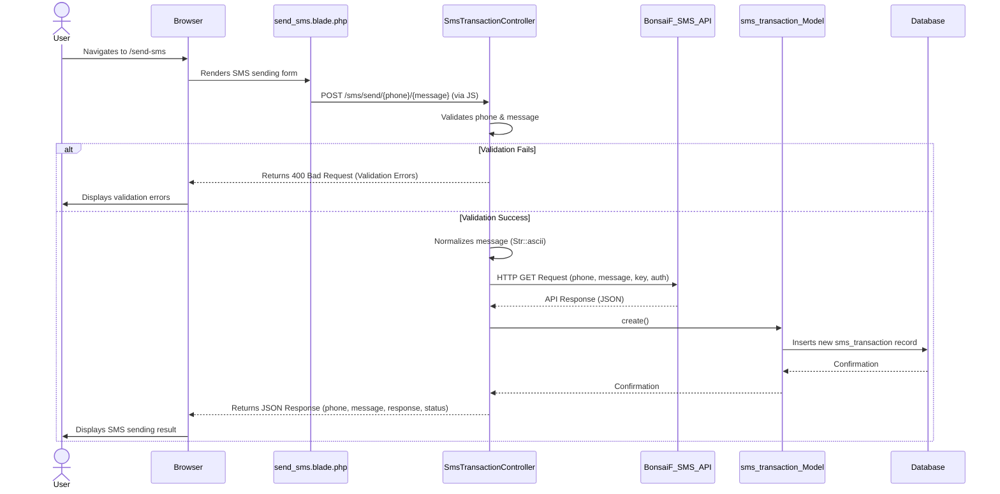

### SMS Sending Flow (`SmsTransactionController`)

### SMS Import Flow (`SmsAttemptView` Livewire Component)

The SMS import process is designed to handle large files efficiently by leveraging Laravel's queue system.

1.  **User Interaction**: The user uploads an Excel/CSV file containing SMS data via the `sms_attemptview.blade.php` view, which is managed by the `SmsAttemptView` Livewire component.
2.  **Livewire Request**: Upon submission, the `importSms()` method in `SmsAttemptView` is called.
3.  **Validation**: The uploaded file is validated (e.g., file type, required).
4.  **Excel Import Initiation**: `Maatwebsite\Excel\Facades\Excel::import()` is called with the `App\Imports\SmsImport` class.
5.  **Queue Dispatch**: Since `SmsImport` implements `ShouldQueue`, `WithChunkReading`, and `WithBatchInserts`, the import process is broken down into smaller jobs and dispatched to the Laravel queue. This allows the web request to complete quickly.
6.  **Page Reload**: After dispatching the import jobs to the queue, the `SmsAttemptView` component triggers a full page reload. This ensures the component is re-initialized and ready for further interactions.
7.  **Queue Worker Processing**: A dedicated queue worker (`php artisan queue:work`) processes the import jobs in the background. Each row (or batch of rows) from the Excel file is handled by the `onRow()` method in `SmsImport`.
8.  **SMS Sending & Logging**: For each row, a `SendAttempt` record is created (initially with 'pending' status), and the `SmsTransactionController::sendSMS()` method is called to send the actual SMS via the external API. The `SendAttempt` record is then updated with the API response and final status ('sent', 'processed', or 'error').
9.  **Data Update**: Once the queue worker has processed all jobs for the import, the `sms_attemptview.blade.php` page, having been reloaded, will display the newly imported and processed SMS records.
10. **Error Handling**: Any errors during individual SMS sends are logged and reflected in the `SendAttempt` status.
