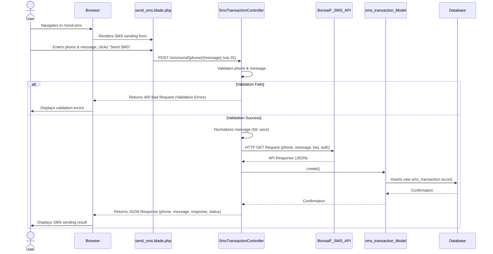
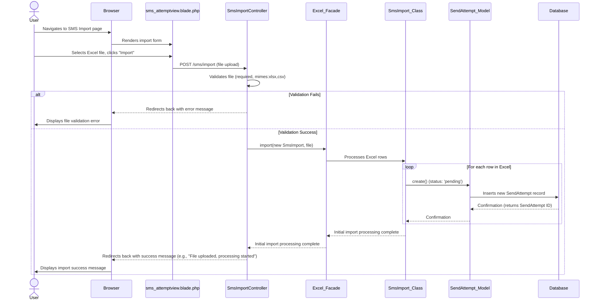
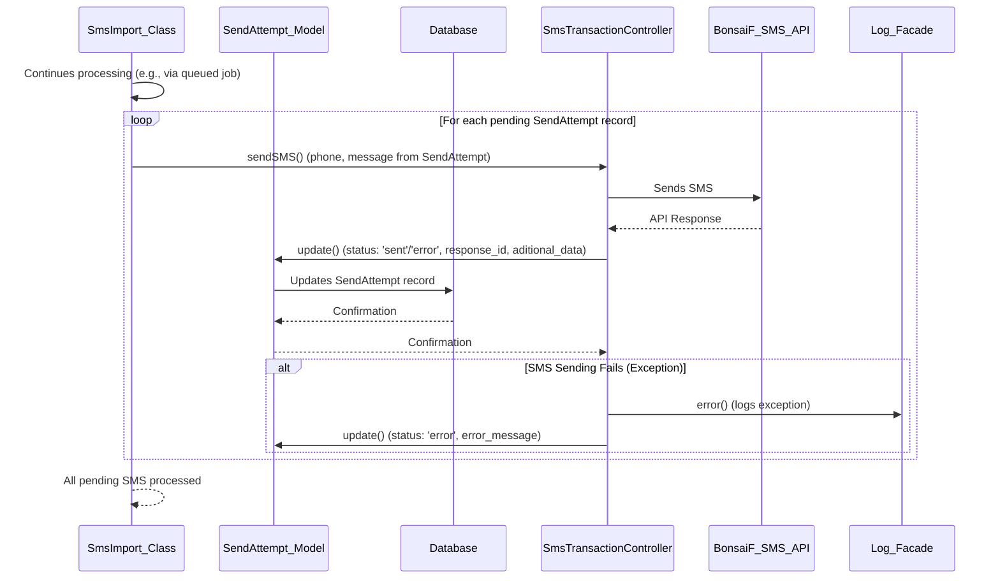

### SMS Sending Flow (`SmsTransactionController`)

```mermaid
sequenceDiagram
    actor User
    participant Browser
    participant send_sms.blade.php
    participant SmsTransactionController
    participant BonsaiF_SMS_API
    participant sms_transaction_Model
    participant Database

    User->>Browser: Navigates to /send-sms
    Browser->>send_sms.blade.php: Renders SMS sending form
    User->>send_sms.blade.php: Enters phone & message, clicks "Send SMS"
    send_sms.blade.php->>SmsTransactionController: POST /sms/send/{phone}/{message} (via JS)
    SmsTransactionController->>SmsTransactionController: Validates phone & message
    alt Validation Fails
        SmsTransactionController-->>Browser: Returns 400 Bad Request (Validation Errors)
        Browser->>User: Displays validation errors
    else Validation Success
        SmsTransactionController->>SmsTransactionController: Normalizes message (Str::ascii)
        SmsTransactionController->>BonsaiF_SMS_API: HTTP GET Request (phone, message, key, auth)
        BonsaiF_SMS_API-->>SmsTransactionController: API Response (JSON)
        SmsTransactionController->>sms_transaction_Model: create()
        sms_transaction_Model->>Database: Inserts new sms_transaction record
        Database-->>sms_transaction_Model: Confirmation
        sms_transaction_Model-->>SmsTransactionController: Confirmation
        SmsTransactionController-->>Browser: Returns JSON Response (phone, message, response, status)
        Browser->>User: Displays SMS sending result
    end
```

### SMS Import Flow - File Upload & Initial Processing

```mermaid
sequenceDiagram
    actor User
    participant Browser
    participant sms_attemptview.blade.php
    participant SmsImportController
    participant Excel_Facade
    participant SmsImport_Class
    participant SendAttempt_Model
    participant Database

    User->>Browser: Navigates to SMS Import page
    Browser->> sms_attemptview.blade.php: Renders import form
    User->>sms_attemptview.blade.php: Selects Excel file, clicks "Import"
    sms_attemptview.blade.php->>SmsImportController: POST /sms/import (file upload)
    SmsImportController->>SmsImportController: Validates file (required, mimes:xlsx,csv)
    alt Validation Fails
        SmsImportController-->>Browser: Redirects back with error message
        Browser->>User: Displays file validation error
    else Validation Success
        SmsImportController->>Excel_Facade: import(new SmsImport, file)
        Excel_Facade->>SmsImport_Class: Processes Excel rows
        loop For each row in Excel
            SmsImport_Class->>SendAttempt_Model: create() (status: 'pending')
            SendAttempt_Model->>Database: Inserts new SendAttempt record
            Database-->>SendAttempt_Model: Confirmation (returns SendAttempt ID)
            SendAttempt_Model-->>SmsImport_Class: Confirmation
        end
        SmsImport_Class-->>Excel_Facade: Initial import processing complete
        Excel_Facade-->>SmsImportController: Initial import processing complete
        SmsImportController-->>Browser: Redirects back with success message (e.g., "File uploaded, processing started")
        Browser->>User: Displays import success message
    end
```

### SMS Import Flow - Individual SMS Sending & Status Update

```mermaid
sequenceDiagram
    participant SmsImport_Class
    participant SendAttempt_Model
    participant Database
    participant SmsTransactionController
    participant BonsaiF_SMS_API
    participant Log_Facade

    SmsImport_Class->>SmsImport_Class: Continues processing (e.g., via queued job)
    loop For each pending SendAttempt record
        SmsImport_Class->>SmsTransactionController: sendSMS() (phone, message from SendAttempt)
        SmsTransactionController->>BonsaiF_SMS_API: Sends SMS
        BonsaiF_SMS_API-->>SmsTransactionController: API Response
        SmsTransactionController->>SendAttempt_Model: update() (status: 'sent'/'error', response_id, aditional_data)
        SendAttempt_Model->>Database: Updates SendAttempt record
        Database-->>SendAttempt_Model: Confirmation
        SendAttempt_Model-->>SmsTransactionController: Confirmation
        alt SMS Sending Fails (Exception)
            SmsTransactionController->>Log_Facade: error() (logs exception)
            SmsTransactionController->>SendAttempt_Model: update() (status: 'error', error_message)
        end
    end
    SmsImport_Class-->>SmsImport_Class: All pending SMS processed
```