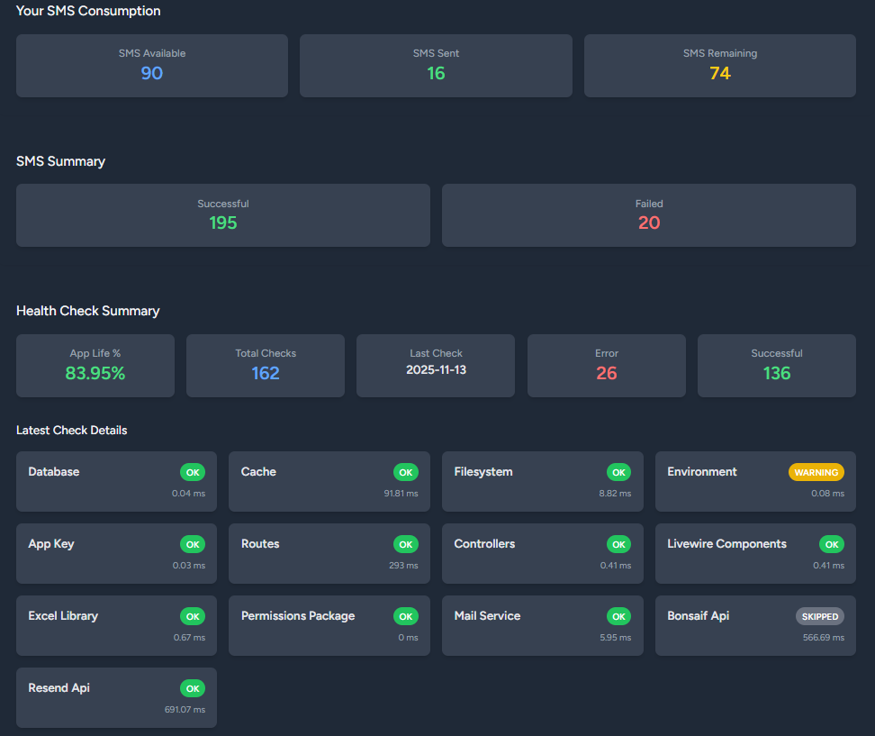

# User Manual - SMS Management System

## 1. Introduction

Welcome to the SMS Management System. This application allows you to send and monitor text messages (SMS) in bulk, manage users, and oversee the overall system status through an intuitive dashboard.

The system is designed for efficiency, utilizing a queue system to process large volumes of SMS dispatches without affecting the user interface performance.

## 2. Getting Started: Access and Login

To begin using the system, navigate to the login page and provide your credentials (email and password).

- **Access URL:** `[Application URL]/login`

Once authenticated, you will be redirected to the main Dashboard.

## 3. Dashboard

The Dashboard is the main screen after logging in and offers a quick overview of the most important information. It consists of several widgets:

- **System Health Summary:** Displays the status of critical application services (Database, Cache, external API, etc.). An "OK" status for all services indicates that the application is functioning correctly.
- **User SMS Consumption:** Presents your personal SMS usage statistics, including total available, sent, and remaining balance.
- **Dispatch Summary:** Provides a count of all SMS dispatch attempts, grouped by their status (Successful, Failed, Pending, etc.).

## 4. SMS Management

This section, accessible from the navigation menu, is the core for SMS dispatch operations. It requires the `import sms` permission.

- **URL:** `/sms/view`

### 4.1. Viewing Dispatches

The main page of this section displays a table with the history of all SMS dispatch attempts.

- **Filters:** You can toggle between "My Records" to see only SMS sent by you, and "All Records" to see those from all users (if you have permissions).
- **Table Columns:** The table includes details such as the recipient (`phone`), the message, the dispatch status (`status`), and the response from the SMS provider (`response_id`).

### 4.2. Batch SMS Import

This functionality allows you to send thousands of SMS by uploading a single file.

**Steps for import:**

1.  Click the **"Choose File"** button.
2.  Clic the **"Import" button.
3.  Select a file from your computer. The system supports **Excel (.xlsx)** and **CSV (.csv)** formats.
4.  The file must contain the required columns for dispatch:

| subject | sponsor | identification_id | phone | message |
| :--- | :--- | :--- | :--- | :--- |
| Message subject | bank | 0-000-15627 | 0123456789 | your menssaje |

5.  Once the file is selected, the system will process it in the background. You can continue using the application while the import is in progress.
6.  Once the background process is complete, new records will appear in the history table as they are processed.

## 5. Administration (Admins Only)

Users with the `admin` role have access to additional sections for system management.

### 5.1. User Management

Allows managing user accounts within the system.

- **URL:** `/users`
- **Features:**
    - View a list of all registered users.
    - Create new users.
    - Edit existing user information and permissions.
    - Activate/Deactivate or delete users.
    
    

### 5.2. Global SMS Consumption Dashboard

Provides a global view of SMS consumption across the entire platform.

- **URL:** `/sms-consumption`
- **Features:** Displays statistical data on SMS usage per user, allowing administrators to monitor consumption and overall activity.

